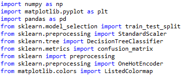
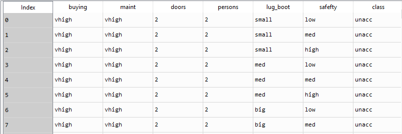
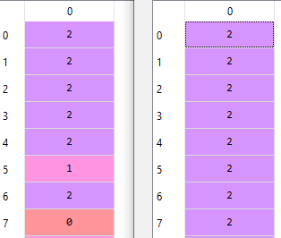
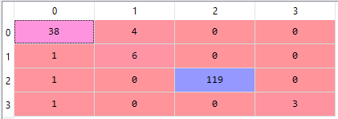
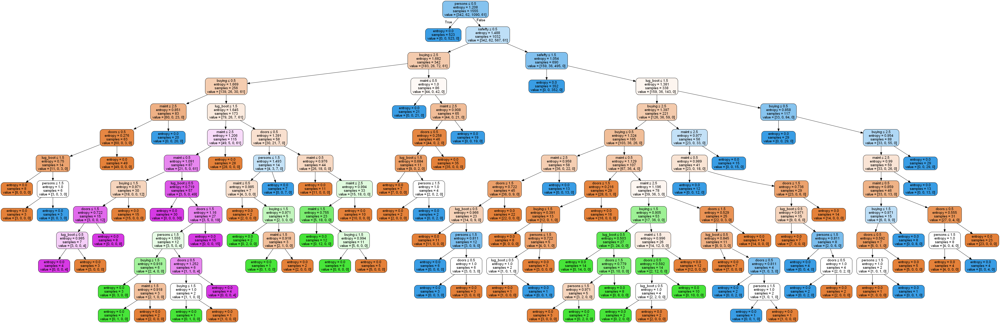

# Assignment A5-1 Car Rental Data Classification
### Build a Decision Tree model to find the car, which clients are most likely to buy.

We have a DecisionTree.py file which contains all the necessary code, a CarData.csv file which contains the data.

___

We start out by importing all our dependencies



Then we import our dataset, with pandas

```python
dataset = pd.read_csv('D:\Code\Python\Decision tree classifier\CarData.csv')
```
which results in a dataframe looking like this:


Our algorithm cant work with strings, so we have to encode our dataset, we chose to do this the old way, with a labelencoder:

```python 
le = preprocessing.LabelEncoder()
encodedDataset = dataset.apply(le.fit_transform)
```
after the encoding our dataset now looks like so:


We noticed that it encoded the numbers as well, this won't be a problem as we aren't dependant on the numbers but rather that they represent different values.

We then divide our dataset into independent variables and dependant variables, hence forth referred to as X and y.

```python
X = encodedDataset.iloc[:,:6].values
y = encodedDataset.iloc[:,6].values 
```

We then split our dataset into training and testing sets:

```python
X_train, X_test, y_train, y_test = train_test_split(X,y,test_size = 0.10, random_state = 0)
```


We then define our classifier and apply the training and testing data:

```python
classifier = DecisionTreeClassifier(criterion='entropy', random_state=0)
classifier.fit(X_train,y_train)
```

We ask for a prediction and compare it with the testing data for a few values, and determine that it is rather accurate:



 but we want a better understanding of the overall picture so we created a confusion matrix

 ```python
 cm = confusion_matrix(y_test, y_pred)
 ```

 

 We have generated a visual representation of the classifier, we used graphviz to create it the code looks like this:

 ```python
 from sklearn.externals.six import StringIO  
from IPython.display import Image  
from sklearn.tree import export_graphviz
import pydotplus

dot_data = StringIO()

export_graphviz(classifier, out_file=dot_data,  
                filled=True, rounded=True,
                special_characters=True,
                feature_names = dataset2.columns)

graph = pydotplus.graph_from_dot_data(dot_data.getvalue())  
Image(graph.create_png())
 
 ```

 And it creates a diagram looking like this:

 